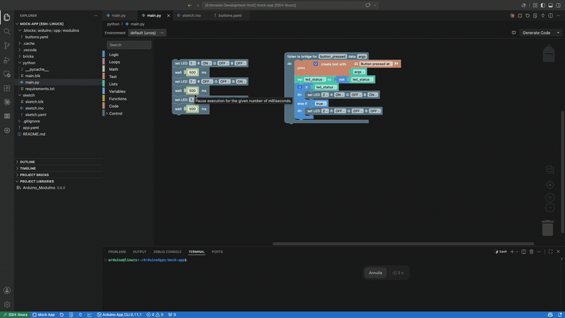

# Arduino App CLI for VS Code

**Run the Arduino UNO Q apps you build with blocks — in plain VS Code.**



Design an Arduino App Lab app with drag-and-drop blocks in
**[Blocks Editor](https://marketplace.visualstudio.com/items?itemName=linucs.blocks-editor)**,
then build, launch and monitor it here, without leaving the editor. This
extension is the **run half** of that workflow: Blocks Editor writes the app,
Arduino App CLI puts it on the board and shows you what it's doing. Hand-written
apps work exactly the same way — blocks are optional.

> **Not a replacement for Arduino App Lab.** Arduino App Lab is the full,
> all-in-one IDE for developing on the UNO Q. This extension doesn't compete with
> it: it's a thin wrapper over the very same `arduino-app-cli` daemon App Lab uses
> under the hood, for people who'd rather drive that daemon from the VS Code they
> already live in — with their own editor, extensions, themes and keybindings.

It's "just another Arduino CLI" by design. Arduino ships official command-line
tools — `arduino-cli` for sketches, `arduino-app-cli` for UNO Q apps — and this
extension gives the App Lab one a native VS Code face, the same way its sibling
**[Arduino CLI IDE](https://marketplace.visualstudio.com/items?itemName=linucs.vscode-arduino-cli-ide)**
does for plain sketches. The CLI does the real work; VS Code does what it's
already great at.

The UNO Q is a dual-brain board: a Linux CPU that runs **Python** apps (in Docker)
and an Arduino **MCU** that runs **C++ sketches**. An *app* bundles both halves
plus reusable **bricks** and optional AI **models** — and your files stay plain
files on disk, edited with VS Code's native editor.

## Why you'll like it

- 🧩 **The other half of Blocks Editor** — write an App Lab app with blocks, then
  run it here; no GUI round-trip, no leaving VS Code.
- 🪶 **Thin** — talks to the on-board `arduino-app-cli` daemon over REST/SSE (and a
  WebSocket for the serial monitor); no heavyweight runtime, no second IDE.
- 🧰 **In-editor** — Apps / Bricks / Models trees, an app-scoped **Run / Stop**, a
  live **Console**, and a serial monitor terminal.
- 📈 **Monitor _and_ plotter** — read text from the board, or graph live numbers as
  they stream in — from the MCU's serial output **or** the Python app's output.
- 🧠 **Native files** — edit `python/main.py` and `sketch/sketch.ino` directly,
  with IntelliSense for both halves — C++ from the sketch's last build and Python
  stubs for the Arduino framework.

## Getting started

### Step 1 — Set up `arduino-app-cli` (required)

This extension **does not bundle** the daemon — that's what keeps it thin. The
`arduino-app-cli` daemon ships on the **Arduino UNO Q** as a systemd service
listening on `127.0.0.1:8800`; the extension drives it. You don't install
anything on the board yourself — you just need to reach that daemon.

### Step 2 — Install this extension

Search for **"Arduino App CLI"** in the VS Code Extensions view, or install from
[Open VSX](https://open-vsx.org) on VSCodium / Cursor / Windsurf.

The natural way to use it is to **open the board in VS Code over Remote-SSH**, so
the extension runs on the board right next to the daemon and your `~/ArduinoApps`
workspace. (A tunnel to the daemon's port works too — see [Settings](#settings).)

### Step 3 — Run your first app

1. Open the **Arduino App CLI** view in the Activity Bar. Your apps appear under
   **My Apps** and ready-made templates under **Examples**.
2. Pick an app (or copy an example to edit) and click **Run** ▶.
3. It compiles & flashes the sketch to the MCU and starts the Python side,
   streaming progress to the **Console**.
4. Click the **Serial Monitor** to see what the board prints back, or **Open data
   plotter** to chart numeric streams live.

That's it — no separate IDE to switch to. Just VS Code.

## The Arduino App CLI sidebar

Click the **Arduino App CLI icon** in the Activity Bar to open the container, with
four tree views:

- **My Apps** — the apps installed on the board (the real ones you run, not the
  read-only examples), each showing its emoji icon, name, and running/default
  state. Click a row to reveal its folder; the context menu offers Run / Stop,
  Show Console, Set as Default, and Delete.
- **Examples** — ready-made app blueprints. Copy one to edit, or run it directly.
- **Brick Catalog** — browse reusable bricks and add them to an app.
- **Models** — the AI models available, with import (Edge Impulse), details, and
  delete.

Two more views appear in the **Explorer** when a file inside an app is open:
**Project Bricks** and **Project Libraries** — the bricks and MCU C++ libraries
that *this* app depends on.

## What you can do

Everything below is available from the **Command Palette** (`Ctrl/Cmd+Shift+P`),
the tree views, the editor toolbar, or the status bar.

| Area | What you get |
| --- | --- |
| **Apps** | New / Run / Stop / Restart / Delete, Console (logs), Export / Import, Copy & Edit (examples), Set Default, Open Exposed Port |
| **Bricks** | Browse the catalog, add to an app, configure variables, rename, remove |
| **Models** | List, import an Edge Impulse project, delete, view details |
| **Sketch (MCU) C++ libraries** | Search the Arduino catalog and add/remove per-app libraries |
| **Serial monitor & plotter** | A terminal over the daemon WebSocket with line-ending control and log save, plus a live data plotter (fed by the serial monitor **or** the Python output) |
| **IntelliSense** | One **Configure IntelliSense** command sets up both halves (see below) |
| **System** | Version, configuration, properties, system update, cleanup, network mode, keyboard, board name |
| **AI assistant** | One command installs a Claude/Copilot skill describing the CLI |

The **Run / Stop / Console / Serial Monitor** controls are *app-scoped*: they act
on whichever app owns the file you're editing (resolved by the nearest `app.yaml`),
and also appear on each app in the tree, in the editor toolbar, and the status bar.

## Plotting data

**Open data plotter** charts live numbers streaming from your app. When you open
it, you choose the source — **Serial Monitor** (the MCU's serial output) or
**Python output** (the app's CPU-side logs) — so the same telemetry format works
whichever half of the board is producing the numbers.

It speaks a subset of the [Teleplot](https://github.com/nesnes/teleplot) serial
protocol, so the same `Serial.print` lines that work with the Teleplot tool work
here too.

**The rule:** a line is plotted only if it starts with a `>` marker. Every other
line is treated as ordinary log text and ignored by the plotter (so you can keep
printing human-readable messages alongside your data). A trailing newline ends
each message.

### Formats

The general shape of a telemetry line is `>name[:timestamp]:value[§unit][|flags]`:

| Line | Meaning |
|------|---------|
| `>name:value` | One point on series **name**, timestamped on arrival |
| `>name:timestamp:value` | One point with an explicit millisecond timestamp |
| `>name:value§unit` | A point carrying a **unit** (shown in the legend) |
| `>name:t1:v1;t2:v2;t3:v3` | **Several points** for one series in a single line |
| `>name:x:y\|xy` | One **XY scatter** point (plot x against y) |
| `>name:x:y:timestamp\|xy` | An XY point with an explicit millisecond timestamp |
| `>name:text\|t` | A **text/log value** — shown as a labelled card, not plotted |

- **`name`** is the series label — points sharing a name are drawn together.
- **`value`**, **`x`**, **`y`** must parse as numbers (integer, decimal, negative,
  or scientific, e.g. `42`, `23.5`, `-33.8`, `1.2e3`). A non-numeric value is
  dropped — unless the `|t` flag marks it as text.
- **`timestamp`** is milliseconds (e.g. from `millis()`); when omitted, the point
  is stamped with the time it arrives in VS Code.
- **`§unit`** (a `§` after the value) labels the series with a unit, e.g. `°C`.
- **`;`** separates several points for the same series in one line — handy for
  batching or replaying buffered samples.
- The **`|xy`** flag marks a scatter point; the **`|t`** flag marks a text value.

This is a subset of Teleplot: 3D shapes (`3D|…`) and remote function calls are
not supported.

### Examples

From the **MCU (C++)** side, plot a single time series:

```cpp
void loop() {
  float temp = readTemperature();
  Serial.print(">temp:");
  Serial.println(temp);          // → >temp:23.5
  delay(100);
}
```

From the **Python** side, the same line plots when you point the plotter at the
Python output:

```python
print(f">temp:{temp}")           # → >temp:23.5
```

Attach a unit (appears in the legend), plot an XY point, or show a text status:

```cpp
Serial.println(">temp:23.5§°C");   // unit
Serial.println(">pos:12:8|xy");    // XY scatter point
Serial.println(">state:Running|t");// text card, not plotted
```

> **Tip:** mix freely. Lines without a leading `>` still show up in the **Serial
> Monitor** (or the **Console**) but are skipped by the plotter, so a single app
> can log status text and stream plottable data on the same stream.

## IntelliSense (code completion)

One **Configure IntelliSense** command sets up both halves of an app:

- **C++ (MCU):** writes `.vscode/c_cpp_properties.json` from the sketch's last
  build (the compilation database under `<app>/.cache/sketch/`), so Microsoft's
  **C/C++** extension resolves the Arduino core, board defines, and libraries.
- **Python (CPU):** writes `.vscode/typings/arduino/**` stubs and points
  `python.analysis.stubPath` at them, so Pylance resolves `arduino.app_utils` /
  `arduino.app_bricks.*` — which otherwise live only in the app image.

Both refresh automatically after each successful run
(`appLab.intellisense.autoConfigure`, on by default).

## Settings

You can leave everything at its defaults. To tweak, open Settings and search for
**"Arduino App CLI"** (or **App Lab**):

| Key | Default | Description |
| --- | --- | --- |
| `appLab.daemon.host` | `127.0.0.1` | Daemon host. |
| `appLab.daemon.port` | `8800` | Daemon port (on-board systemd service). |
| `appLab.cliPath` | `arduino-app-cli` | CLI binary, used for CLI-only commands (clean-cache, system init/cleanup/…). |
| `appLab.apiKey` | `""` | Optional `X-API-Key` header. |
| `appLab.monitor.lineEnding` | `lf` | Serial monitor line ending. |
| `appLab.logs.tail` | `200` | Lines requested when opening a console. |
| `appLab.intellisense.autoConfigure` | `true` | Refresh IntelliSense (C++ config + Python stubs) automatically after each successful run. |

## Works great with Blocks Editor

**[Blocks Editor](https://marketplace.visualstudio.com/items?itemName=linucs.blocks-editor)**
(`linucs.blocks-editor`) is the other half of the story. It's a visual,
Scratch-like editor that lets you build programs by **dragging blocks** instead of
typing — and for an Arduino App Lab app (`app.yaml`) it generates real **Python**
under the hood.

But generated code is just a file until something runs it — and that's where this
extension comes in. Blocks Editor writes the app; *this* extension's **Run**
button builds it, flashes the MCU sketch, starts the Python side, and streams the
output back. Together they're a complete loop: drag blocks → run → watch the
console and plotter. Drawn as a picture:

```
Blocks Editor               Arduino App CLI                Arduino UNO Q
  drag blocks  ──►  generates the app  ──►  run (build +  ──►  MCU + Python
                                            flash + start)      run together
                                            console / plotter ◄──  logs & data
```

Each one is fully standalone, so you can use either alone — but they're designed to
be two halves of one workflow: **Blocks Editor builds, this extension runs.** The
same pairing exists for plain sketches via
**[Arduino CLI IDE](https://marketplace.visualstudio.com/items?itemName=linucs.vscode-arduino-cli-ide)**.

## Requirements

- VS Code **1.120+**.
- An **Arduino UNO Q** running the `arduino-app-cli` daemon.
- Reaching the board over **Remote-SSH** (recommended) or a tunnel to its daemon.
- For C++ IntelliSense: Microsoft's **C/C++** extension. For Python: **Pylance**.

## Good to know

- **It stays out of your way.** This is a thin wrapper: it drives the same
  `arduino-app-cli` daemon the Arduino App Lab GUI uses, rather than reimplementing
  the build/run logic. What runs here is what runs there.
- **Your files are the source of truth.** Apps are plain folders on disk
  (`app.yaml`, `python/main.py`, `sketch/sketch.ino`, bricks, models) — edit them
  with VS Code's native editors, version them with git, no proprietary project format.
- **Built to run alongside Remote-SSH.** Because it talks to a local daemon, the
  extension is happiest running *on the board* next to the daemon and your apps.

## For developers

```bash
yarn install
yarn compile     # type-check + lint + l10n gate + bundle
yarn test        # SSE parser + mock-daemon transport tests
yarn vsix        # build a .vsix
```

The transport core (`src/appLabClient.ts`, `src/sseParser.ts`, `src/daemon.ts`)
has no VS Code dependency and is unit-tested against a mock daemon. See
[`PUBLISHING.md`](PUBLISHING.md) for the release process.

## Community

Questions, ideas, or just want to show what you built? Join the
[GitHub Discussions](https://github.com/linucs/vscode-arduino-app-cli/discussions).

## Contributing

Contributions and bug reports are welcome — open an issue or pull request on the
[repository](https://github.com/linucs/vscode-arduino-app-cli).

## License

[MIT](LICENSE)
